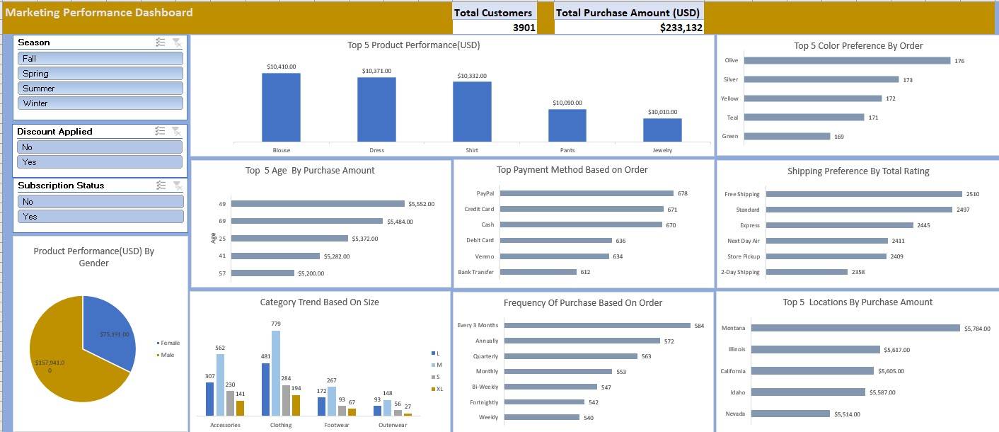

# Marketing-Performance-Analysis

## Introduction
This is a Microsoft Excel project on the sales analysis of an imaginary store called **Shopping**.
The project is to provide insight into where the marketing department can channel their campaign effort.

**_Disclaimer_**: _All datasets and reports do not represent any company, institution, or country but are just a dummy dataset to demonstrate the capabilities of Microsoft Excel._

## Problem statement
1 Which Product has the highest performance on Total Purchase Amount in relative to Season,Discount available and subscription status?

2. What are the customer choices with respect to color?

3. How does customers age influence the Total amount of Product purchased?

4. Which payment method has the greatest impact based on order?

5. Which delivery method has the greatest impact based on total rating?

6. What are the customers category trend based on size?

7. Which gender has a higher performance in relative to Discount available and subscription status?

8. What is the frequency of Purchase based on order?

9. What are the top customers location based on purchase amount?

## Skills
The following Microsoft Excel skills were incorporated:
-Data analysis

-Formatting

-Interactivity

-Dashboard Design

-Data Connection

-Data Cleaning

-Data Validation 

-Documentation

## Modelling
The modeling technique for creating the dashboard involved using descriptive analytics which focused on visualization, trend analysis, and charts to analyze sales data, customer preferences, seasonal patterns, and other relevant metrics.

## Visualization
The report comprises of only one (1) page:
1. Marketing Performance Dashboard

You can interact with the report [here](https://view.officeapps.live.com/op/view.aspx?src=https%3A%2F%2Fraw.githubusercontent.com%2FKighoorobosa%2FMarketing-Performance-Dashboard%2Fmain%2FProject%2520Dataset.xlsx&wdOrigin=BROWSELINK)
## Features
-Key Metrics Overview

-Product Performance

-Customer Preferences

-Seasonality Analysis

-Interactive Filters.

-Geographical Analysis

-Trend Analysis

-Customizable Layout

-Export and Sharing

## ANALYSIS
### Customer History:
There are 3901 customers.

### Product Catalog:
There 25 products in the shop.

### Transaction History
Total Purchase Amount is 233,132(USD)

Marketing Performance Dashboard:

## Conclusion:
They are 25 products in the store with a total purchase amount of 233,132.00USD

## Recommendation:     
Utilize geographical insights to target marketing efforts in regions with high demand, while focusing on promoting top-selling products to maximize revenue. Personalize marketing communications based on customer preferences and optimize conversion rates through continuous monitoring and refinement of marketing strategies.

